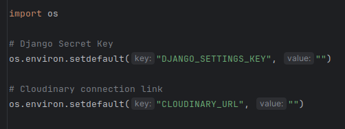

# Property Website

---

## Overview

This is a London-based property website.
This forms part of my final Project for Code Institute

---

## Table of Content

- [Planning](#planning)
- [Deployment](#deployment)
  - [Setting up on Heroku](#setting-up-on-heroku)
  - [Forking the GitHub Repository](#forking-the-github-repository)
  - [Making a Local Clone](#making-a-local-clone)
  - [Environment Variables](#environment-variables)
- [Testing](#testing)
  - [Manual Testing](#manual-testing)
  - [Auto Testing](#auto-testing)

---

### [Planning](#table-of-content)

---

### [Deployment](#table-of-content)

Index
- [Setting up on Heroku](#setting-up-on-heroku)
- [Forking the GitHub Repository](#forking-the-github-repository)
- [Making a Local Clone](#making-a-local-clone)
- [Environment Variables](#environment-variables)

- Make sure to install [Docker Desktop](https://www.docker.com/)
- If you need additional assistance to install docker desktop
- click [here](https://www.youtube.com/watch?v=31ieHmcTUOk&list=PL4cUxeGkcC9hxjeEtdHFNYMtCpjNBm3h7) for YouTube video tutorials on getting setup

#### [Setting up on Heroku](#deployment)

- head over to [Heroku Dashboard](https://id.heroku.com/login) to Login
- once login, click on New for creating a new project
- type in the new name for the app
- click on what region you are wanting your server to be in
- once the app has been created, locate the tab that says, "Deploy"
- under the deployment method, connect your GitHub account to your app and search for your repo
- when you have connected your repo manual deploy your main branch
- once manually deployed, it will fail next would be to get the environment variables up and running
- locate the settings tab at the top
- scroll down until you see config vars
- click the purple button that says, "Reveal Config Vars"
- add the [environment variables](#environment-variables) on the Heroku Dashboard
- then rebuild the application on the Deploy tab
- make sure to add Heroku Postgres as an addon
- once you have added the addon it auto create the env for the database

Note: build packs might not be necessary as I am using docker containers

#### [Forking the GitHub Repository](#deployment)

- Locate this [repository](https://github.com/douglas86/ci-pp5-property)
- make sure that you are on the tab that says, "Code"
- when on that tab, locate the tab that says, "Fork"
- Click on the Fork tab
- Once it has been forked
- You need to clone it to your [local machine](#making-a-local-clone)

#### [Making a Local Clone](#deployment)

- Making a local clone of this repo can either be done by ssh or http
- make sure that ssh is set up correctly on your PC before using it
- to ssh use the following command

```
git clone git@github.com:douglas86/ci-pp5-property.git
```

- to use http use the following command

```
git clone https://github.com/douglas86/ci-pp5-property.git
```

- create an .env file inside the backend directory
- scroll down to the [environment variables](#environment-variables) section of this document
- once the local environment variables have been created
- you need to then start the virtual machine
- to do that cd into the backend directory

```
cd backend
```

- to start your virtual machine, use the following command

```
source .venv/bin/activate
```

- this is going to be used for when you have to install new python packages
- once the virtual environment has started
- you can then start up the docker container
- make sure that docker desktop is running first
- then use the following command

```
docker-compose up
```

#### [Environment Variables](#deployment)



- create the necessary environment variables

DJANGO_SETTING_KEY environment variable

- django secret keys should never be committed to GitHub
- so if you need one, follow the following link
- [generate a new secret key](https://www.makeuseof.com/django-secret-key-generate-new/#:~:text=You%20can%20accidentally%20make%20your,are%20still%20learning%20about%20GitHub.)

CLOUDINARY_URL environment variables

- Login to your [cloudinary account](https://cloudinary.com/users/login)
- Locate your Profile image, which you should see at the bottom of the tab on the left
- Once on your profile page, go to your API Keys section
- At the top of that page copy the one that says, API environment variable
- place the API Key and API Secret in the correct places in the key parameters
- this key can now be placed in Heroku or for local development
- on the Heroku dashboard, there are two sections of the key and the value
- place CLOUDINARY_URL in the key section
- and your api key in the value section
- on the local development in the .env file
- create the following object:
- placing CLOUDINARY_URL as the key
- and the api key for cloudinary as the value

---

### [Testing](#table-of-content)

#### [Manual Testing](#table-of-content)

- Login Form

| Title                                                      | Pass/Fail |
|------------------------------------------------------------|-----------|
| All Fields required                                        | Pass      |
| Form validation works with React hook form                 | Pass      |
| Click to Register: Register form loads                     | Pass      |
| Click to change password: Change Password form loads       | Pass      |
| Form validation works from server and is displayed on form | Pass      |
| Click on "X" closes the modal                              | Pass      |
| Click on Cancel modal is closed                            | Pass      |
| Modal title says, "Login Form"                             | Pass      |
| Click on "Login" data gets sent to server                  | Pass      |

- Register Form

| Title                                                     | Pass/Fail |
|-----------------------------------------------------------|-----------|
| Modal title says, "Registration Form"                     | Pass      |
| Click Login button: Login form loads                      | Pass      |
| All Fields required validation                            | Pass      |
| Form Validation works in React hook form                  | Pass      |
| Check if password 1 and 2 match                           | Pass      |
| Check for common passwords throw validation error         | Pass      |
| Check if password is numeric throw validation error       | Pass      |
| Check if length of passwords are longer than 8 characters | Pass      |
| Click on "Register" data gets sent to server              | Pass      |
| Click on Cancel modal is closed                           | Pass      |
| Click on "X" modal is closed                              | Pass      |
| Form validation works on server and is displayed on form  | Pass      |

- Change Password Form

| Title                                                             | Pass/Fail |
|-------------------------------------------------------------------|-----------|
| click Register button: register form Loads                        | Pass      |
| click login button: login form loads                              | Pass      |
| Modal title says, "Change Password Form"                          | Pass      |
| Click on "X" modal is closed                                      | Pass      |
| Click on Cancel modal is closed                                   | Pass      |
| All Fields required validation                                    | Pass      |
| Check for common password for new_password throw validation error | Pass      |
| Check if password is numeric throw validation error               | Pass      |
| Check new_password is longer than 8 characters                    | Pass      |
| Form validation works in React hook form                          | Pass      |
| Form validation works on server and is displayed on form          | Pass      |

- Logout Form

Still busy testing


#### [Auto Testing](#table-of-content)

---