# Property Website

---

## Overview

- This Project is of a London-based property website.
- Where a potential client can see the property that they want to buy
- With all the details of that property
- This project was built using React and Django Rest Famework


My Live sites

- [React](https://ci-pp5-property-react-6f6a16e0405e.herokuapp.com/)
- [Django Rest Framework](https://ci-pp5-property-django-bcd4d87abb1f.herokuapp.com/)

---

## Table of Content

- [Planning](#planning)
  - [Wireframes](#wireframes)
  - [UX/UI Designs on Figma](#uxui-designs-on-figma)
  - [Color pallet](#color-pallet)
  - [ERD diagrams for mapping out my models](#erd-diagrams-for-mapping-out-my-models)
  - [User Stories using MOSCOW Prioritization techniques](#user-stories-using-moscow-prioritization-techniques)
- [Features](#features)
  - [Project Description](#project-description)
  - [GitHub Branching Strategy](#github-branching-strategy)
  - [Atomic Design Methodology](#atomic-design-methodology)
  - [Daphne Implementation for async/await with Django Rest Framework](#daphne-implementation-for-asyncawait-with-django-rest-framework)
- [Deployment](#deployment)
  - [Setting up for Local development](#setting-up-for-local-development)
  - [Setting up on Heroku](#setting-up-on-heroku)
  - [Database manipulation](#database-manipulation)
  - [Environment Variables](#environment-variables)
- [Testing](#testing)
  - [Manual Testing](#manual-testing)
  - [Auto Testing](#auto-testing)
    - [Testing the API locally](#testing-the-api-locally)
    - [Testing React locally with Cypress](#testing-react-locally-with-cypress)
- [Bugs](#bugs) 
  - [404 aren't found when updating properties](#404-arent-found-when-updating-properties)
  - [Listing of the last remaining bugs](#listing-of-the-last-remaining-bugs)
- [Credits](#credits)

---

### [Planning](#table-of-content)

Section Index
- [Wireframes](#wireframes)
- [UX/UI Designs on Figma](#uxui-designs-on-figma)
- [Color pallet](#color-pallet)
- [User Stories using MOSCOW Prioritization techniques](#user-stories-using-moscow-prioritization-techniques)

#### [Wireframes](#planning)

- Landing Page (Homepage)

Desktop

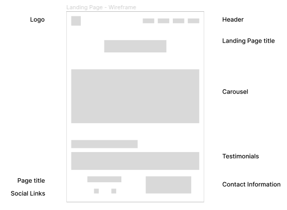

Mobile

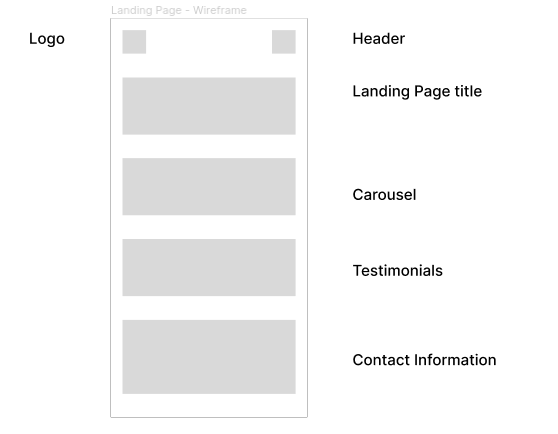

- About Page

Desktop

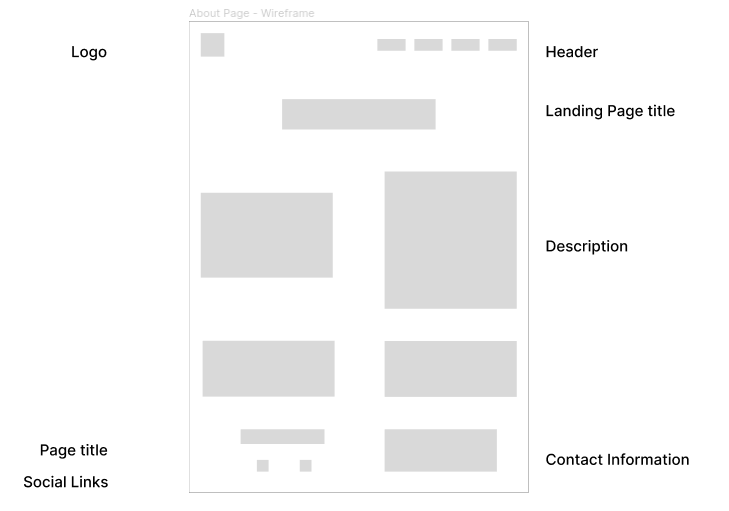

Mobile

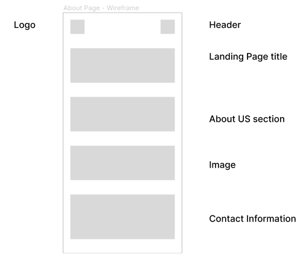

- Admin Dashboard Page: Profiles of the users using the site

Desktop

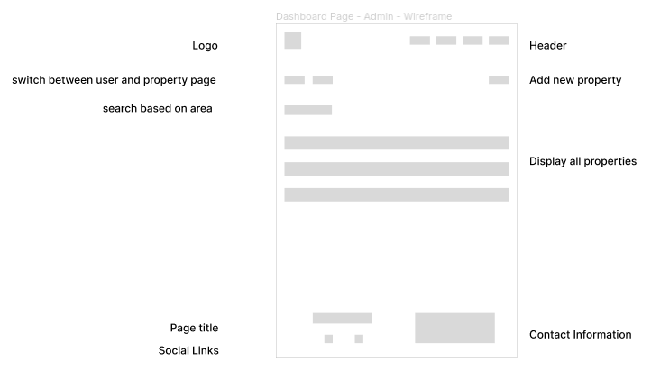

Mobile

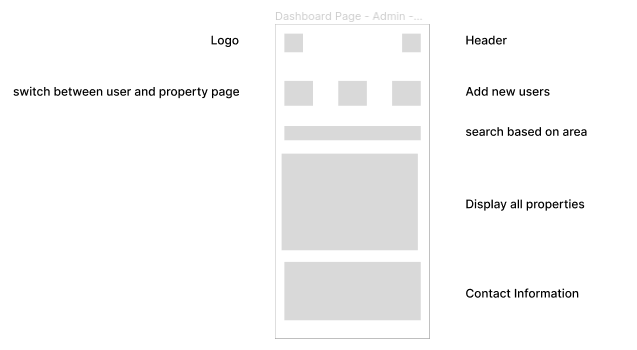

- Admin Dashboard Page: Displaying of the users

Desktop

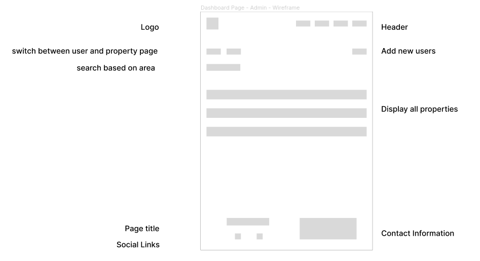

Mobile

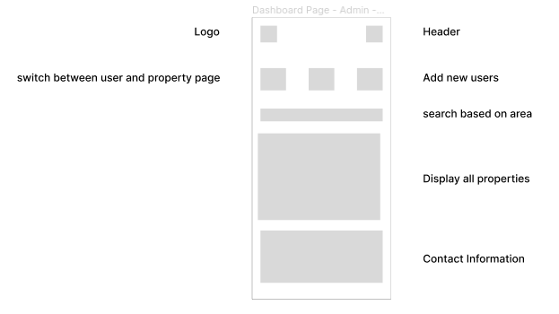

- User Dashboard Page

Desktop

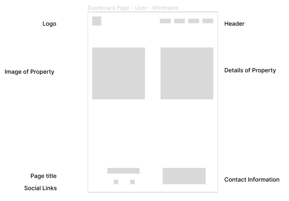

Mobile

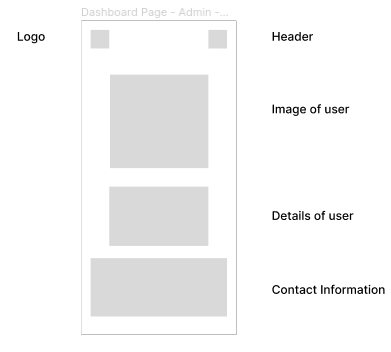

#### [UX/UI Designs on Figma](#planning)

- Landing Page (Homepage)

Desktop

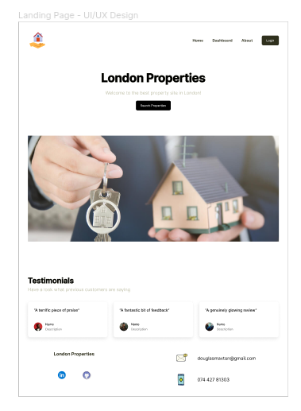

Mobile


- About Page

Desktop

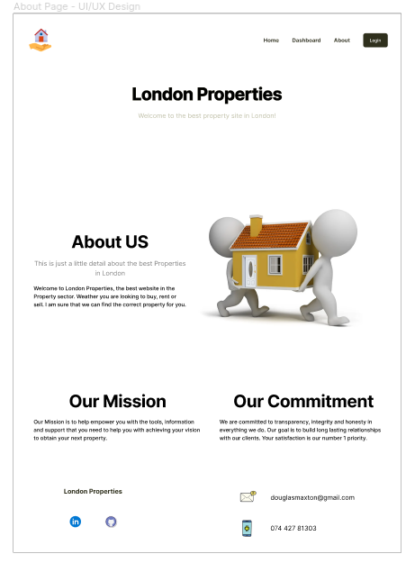

Mobile


- Admin Dashboard Page: Profiles of the users using the site

Desktop

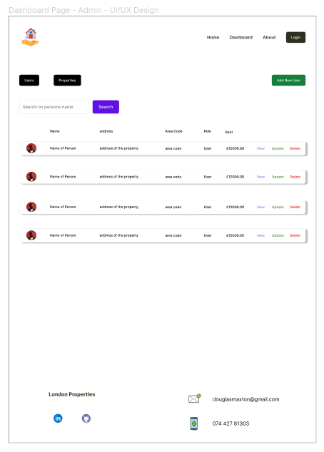

Mobile

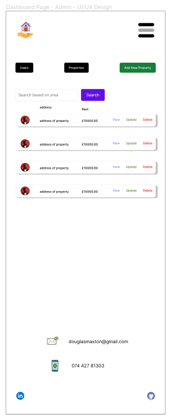

- Admin Dashboard Page: Displaying of the users

Desktop

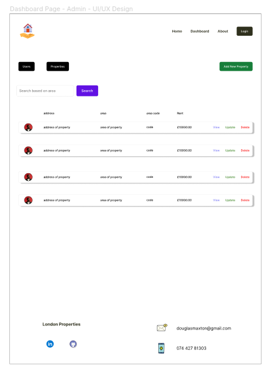

Mobile

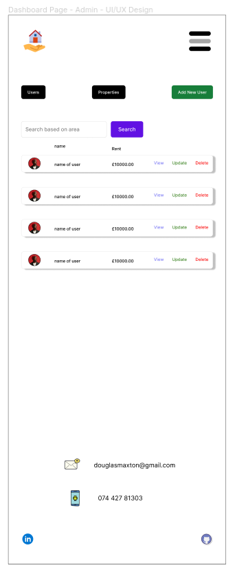

- User Dashboard Page

Desktop

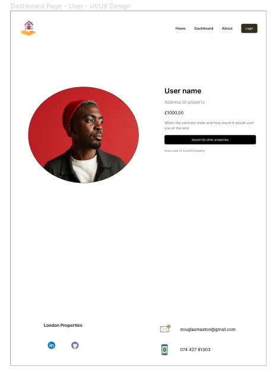

Mobile

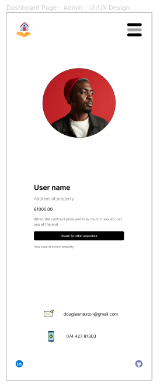

#### [Color pallet](#planning)

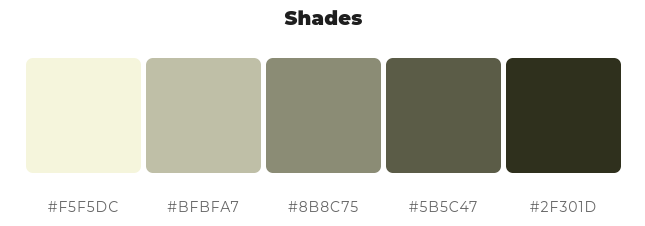

#### [ERD diagrams for mapping out my models](#planning)


#### [User Stories using MOSCOW Prioritization techniques](#planning)

##### Description

- This project was designed following the Agile Methodology
- Starting with the completion of the Landing Page
- Once that was completed, then move on to the next section
- Creating this Project feature by feature
- I first started with creating all the issues needed for the Landing Page
- GitHub bot would move that to the backlog and I would move it to Ready
- Then, before I started the cards for the Landing Page, I would create cards for the About Page
- Trying to always have something in the Backlog section of the Kanban board

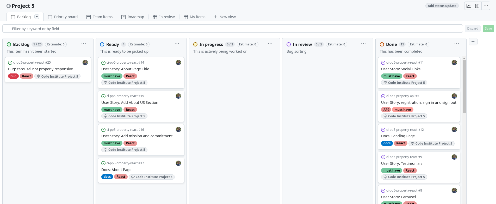

##### Milestones

Landing Page

- The percentage of milestones completed
- 66% complete
- Open 5
- Ten closed

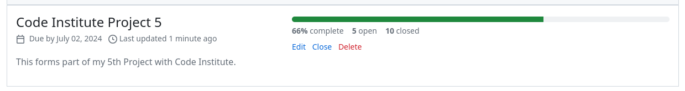

About Page

- The percentage of milestones completed
- 60% complete
- Open 9
- Fourteen closed

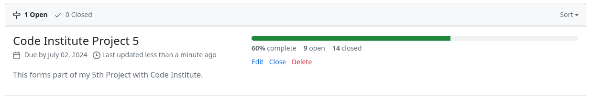

### [Features](#table-of-content)

Section Index
- [Project Description](#project-description)
- [GitHub Branching Strategy](#github-branching-strategy)
- [Atomic Design Methodology](#atomic-design-methodology)
- [Daphne Implementation for async/await with Django Rest Framework](#features)

#### [Project Description](#features)

- This is a complete CRUD application to help solve the Management of Properties
- During the design and implementation of this Project Agile Methodology was followed
- While using the GitHub Branching Strategy
- I was also able to make full use of the Atomic Design Methodology for the Look and feel of the site
- Async/Await was used for the Server side structure to make it very responsive on the server side

#### [GitHub Branching Strategy](#features)

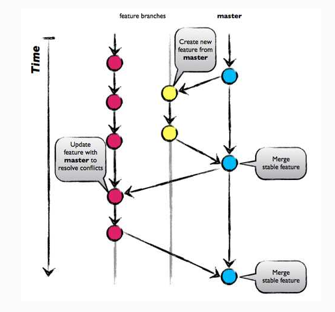

- During the management of this Project, GitHub Branching Strategy was chosen
- GitHub Flow was chosen as it is a simpler alternative to GitFlow
- Where I just have the main branch and all other branches get branched and merged off of main
- The main purpose of this branching strategy was to keep the main branch production ready
- And hence can support Continuous integration (CI) and Continuous Delivery (CD) processes

GitHub Flow Pros and cons

- GitHub Flow focuses on Agile principles and so it is a fast and streamlined branching strategy with short production cycles and frequent releases.
- This strategy also allows for fast feedback loops so that teams can quickly identify issues and resolve them.
- Since there is no development branch as you are testing and automating changes to one branch which allows for quick and continuous deployment.
- This strategy is particularly suited for small teams and web applications, and it is ideal when you need to maintain a single production version.
- Thus, this strategy is not suitable for handling multiple versions of the code.
- Furthermore, the lack of development branches makes this strategy more susceptible to bugs and so can lead to an unstable production code 
- If branches are not properly tested before merging with the release preparation and bug fixes happen in this branch. 
- The main branch, as a result, can become cluttered more easily as it serves as both a production and development branch.
- A further disadvantage is as this model is more suited to small teams and hence, 
- as teams grow, merge conflicts can occur as everyone is merging to the same branch 
- and there is a lack of transparency, meaning developers cannot see what other developers are working on.

#### [Atomic Design Methodology](#features)

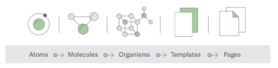

Description

Atomic design, developed by Brad Frost and Dave Olsen, is a methodology for crafting design systems
with five fundamental building blocks which, when combined, promote consistency, modularity and scalability.

The five building blocks are Atoms, Molecules, Organisms, Templates and Pages

Atoms

Basic building blocks of matter, such as a button, input and a form labeled. They're not useful on their own.

Molecules

Grouping atoms together, such as combining a button, input and form labeled to build functionality.

Organisms

Combining molecules to form organisms that make up a district section of an interface (i.e., navigation bar)

Templates

Consisting mostly of groups of organisms to form a page—where clients can see a final design in place.

Pages

An ecosystem that views different template renders.
We can create multiple ecosystems into a single environment—the application

Description of the design structure in a project setting

- The Atomic structure will be placed in the components directory
- The components directory I define as anything that you can see within the UX/UI design
- There are other components that fall out of the spec of the Atomic Structure
- For example, App.jsx, which sits in the construction directory
- this component has two purposes to call the Layout template for the header and footer
- it is also used for routing of pages

Description of Project structure

- assets directory: used to store all static files like images for this document
- components directory: this is where the atomic design sits
- construction directory: this is where the App.jsx will sit
- context directory: all state store and reduced functions will be stored here
- hooks directory: storing of all custom designed hooks
- styles directory: CSS module files will be placed here
- utils directory: If I need some sort of logic that is going to be used often, used as helper functions
- index.js: The most important file in this project, 
- used for two purposes: 
- use as a wrap for the Provider function with the state store and to attach itself to the HTML file for Rendering App.jsx

- There is a directory that is used outside the scope of the src directory
- called cypress
- this directory is used for the Cypress Testing framework

#### [Daphne Implementation for async/await with Django Rest Framework](#features)

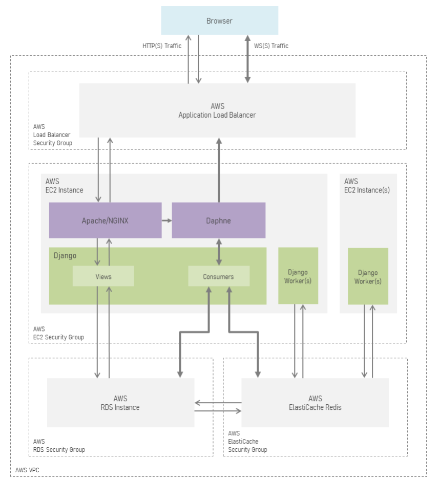

Use Case of Daphne

- Daphne is an HTTP, HTTP2 and WebSocket protocol server for ASGI and ASGI-HTTP, developed to power Django Channels.
- It supports automatic negotiation of protocols; there’s no need for URL prefixing to determine WebSocket endpoints versus HTTP endpoints.
- This is crucial for applications that require real-time communication, 
- like chat applications, notifications or live updates

Why Daphne?

- Traditional DRF and Django are built on a synchronous request-response model (HTTP).
- However, WebSockets require asynchronous handling to maintain persistent, real-time connections between server and client.
- Daphne is an asynchronous ASGI (Asynchronous Server Gateway Interface) server designed to handle this,
- allowing you to manage WebSockets and other asynchronous protocols.

Why Did I choose Daphne for this Project?

- Python is trying to move more towards asynchronous programming, especially in web frameworks
- This Project is intended to be a long-lived project
- The hoping that the future of this project can provide a chat like system
- Where clients can book for maintenance issues on their properties and receive live updates on what is happening
- Or where maintenance officers need to give live updates to their call centers
- with the use of Daphne, I am hoping that it will improve performance issues within the app
- No more sitting around and waiting for a response

---

### [Deployment](#table-of-content)

Index
- [Setting up for Local development](#setting-up-for-local-development)
- [Setting up on Heroku](#setting-up-on-heroku)
- [Database manipulation](#database-manipulation)
- [Environment Variables](#environment-variables)

#### [Setting up for Local development](#deployment)

Requirements for setting up locally

- [Docker Desktop](https://docs.docker.com/get-started/get-docker/?_gl=1)
- [Node version 22.11](https://nodejs.org/en/download/package-manager)

Installation instructions

- Make sure that Docker Desktop is up and running before you start these instructions
- If you need additional assistance to get docker up and running
- Have a look at this [Docker Crash course](https://www.youtube.com/watch?v=31ieHmcTUOk&list=PL4cUxeGkcC9hxjeEtdHFNYMtCpjNBm3h7)

clone repository

- locate the directory where you want to install this project
- you can clone this repo either by ssh or http

ssh

```
git@github.com:douglas86/ci-pp5-property.git
```

http

```
https://github.com/douglas86/ci-pp5-property.git
```

- once it has been cloned
- create a .env file inside the backend directory: this is where Django is developed
- for local development, you only need one [environment variable](#environment-variables)
- CLOUDINARY_URL: this key is used to store and retrieve images from cloudinary
- see [environment variable](#environment-variables) section
- before you start the docker container, make sure to have docker desktop up and running
- once Docker desktop is running open up a terminal on the IDE that you are wanting to use
- I have created a node script to make running docker containers easier for you
- run the command npm run du
- this is just running docker-compose up

```
npm run du
```

- when running this command, it also runs the database migrations on the container
- if you are wanting to tear down docker, there is a script for that two
- run npm run dd

```
npm run dd
```

- that is to tear down docker container running docker-compose down
- if you go to your browser
- and type in localhost:3000 for React
- and in another tab type localhost:8000 for Django
- you will see the apps running

#### [Setting up on Heroku](#deployment)

Requirements for setting up on Heroku

- Make sure that you have this project running [Locally](#setting-up-for-local-development) first
- Make sure that [Heroku CLI](https://devcenter.heroku.com/articles/heroku-cli) is installed on your system

Installation Instructions

- Login to [Heroku Dashboard](https://id.heroku.com/login)
- Once on the heroku dashboard
- we then need to create two apps
- one for React and the other for Django
- click on the New button on the right-hand side


- Click on Create new app in the popup window
- it will take you to a screen where you can add app name and region


##### Create React App

- click create app
- make a note of the app name
- in this case, it is called ci-pp5-property-react
- go to your local environment and place that name in the package.json file
- this package.json file does not sit in any directories
- replacing the name in the react:push and react:release scripts
- we will come to that again later
- in the heroku dashboard for this app, go to settings tab
- as there is just one environment variable that needs to be added
- REACT_APP_NODE_ENV
- you can find out how to add it in the [environment variable](#environment-variables) section


##### Create Django App

- Go back to your dashboard to create the Django app
- following the same process as before with create a new app


- click on create new app that will take you to the app dashboard
- make sure to take note of the app name
- in this case, it is called ci-pp5-property-django
- go to the package.json file this file is not in any directory
- there are three scripts that you need to change with this name
- django:migrate, django:release and django:push scripts need to change


- then go back to the heroku dashboard in your web browser
- locate the resource tab at the top
  
- 

- in the Add-ons search bar, find the Heroku Postgres database
- click on the one that says, "Heroku Postgres"


- this will present you with the screen for the database


- make sure to select Essential 0 as it is the least expensive
- then you can click on Submit Order Form button at the bottom
- once the database has finished, you should see the save as the image below


- the database will automatically add the environment variables to your config vars
- then scroll down to Config Vars clicking on Reveal config vars
- you need to have three [environment variables](#environment-variables) as the database is added for you
- ENV, CLOUDINARY_URL, DJANGO_SETTING_KEY
- see [environment variables](#environment-variables) section

Getting ready for heroku

- The next stage is deploying to heroku
- open up two tabs
- the one tab is for React heroku app, the other is for django heroku app
- on the React heroku app go to logs by clicking on more than click on view logs


- do the same thing with django heroku app


- it will bring you to the log screen


- then go back to the terminal to make sure that you are not in the frontend or backend directory
- I have made a script that will make it easier for you to deploy to heroku
- on the command line type: npm run heroku

```
npm run heroku
```

- sometimes it is possible that you see and error saying, "Memory quote exceeded"
- that just seems to be a warning as the app still works

React logs


Django logs


- once it has finished, you can click on open app for both of the heroku apps


- when you open up the heroku app, copy the path in the url
- as that is needed for useFetch hook in React


- on your local machine, go to the directory that says, "frontend"
- locate the apiSettings file you should find it in the utils directory
- replace the heroku url that was just copied for this url


- you have now finished setup for local and heroku deployment 

#### [Database manipulation](#deployment)

Description

- This section deals with manipulating your heroku or local database
- Without using the command line

Requirements for Database Manipulation

- Install [dbeaver](https://dbeaver.io/download/)

Installation instructions

- once installed, open up the app from where it is installed
- it should look like the image below

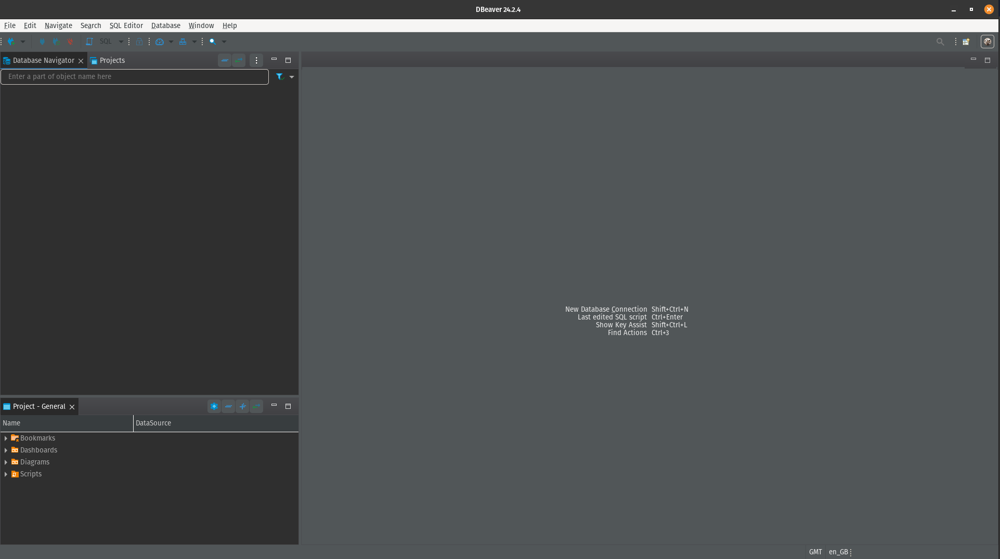

- to start a new database connection
- click the add-icon in the far left-hand corner

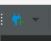

- you should see a menu like this popup


- select the database that you want
- for this project, I chose to use PostgresSQL
- so click on that Image

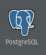

- once selected, click next
- that will bring you to a screen were you can create all your settings

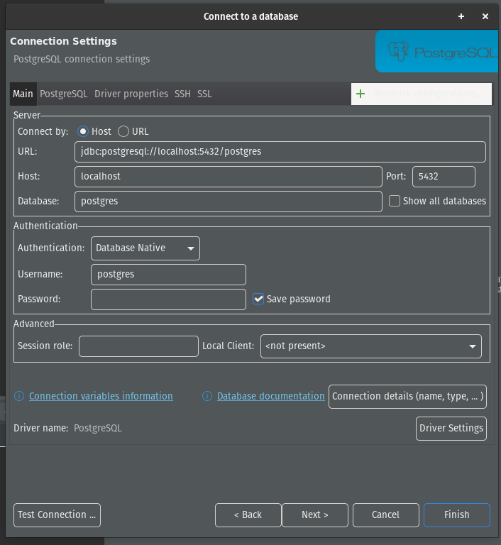

Connect to Heroku Postgres Database

- for this demonstration, I will be using the following connection string
- postgres://u3fon4jhlo790r:pdebdc4cf93dfcb1378061529a7a8f8254fc462179a31aaa184d8e80aeebd1546@cd27da2sn4hj7h.cluster-czrs8kj4isg7.us-east-1.rds.amazonaws.com:5432/d114t1oa0pt1n4
- this connection string was taken for the database url environment variable in heroku dashboard
- in the Server section, click the radio button that says, "URL"
- in the connection string copy from the letter after the "@" symbol
- and paste it in the URL: section
- it should look like this
- jdbc:postgresql://cd27da2sn4hj7h.cluster-czrs8kj4isg7.us-east-1.rds.amazonaws.com:5432/d114t1oa0pt1n4

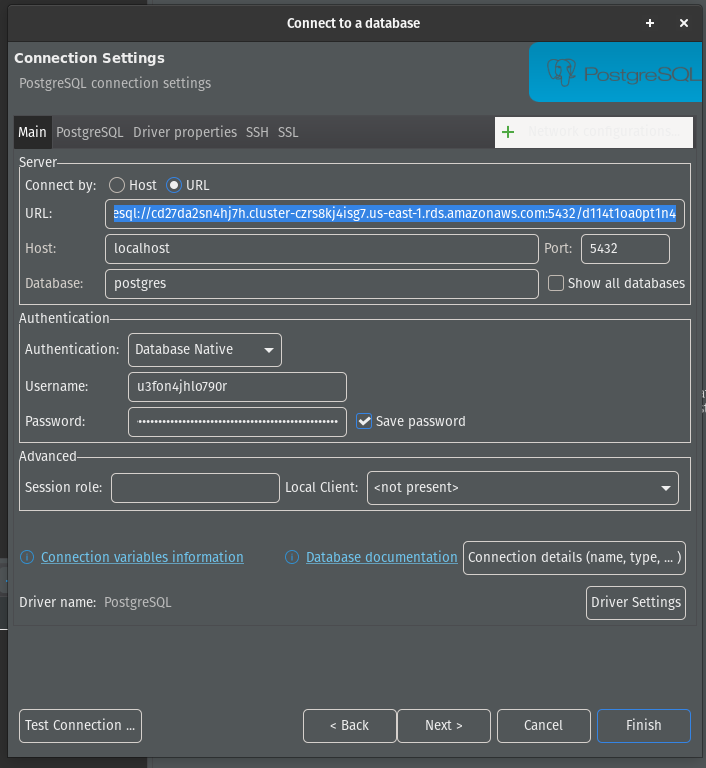

- remember to enter the username and password
- make sure the Authentication dropdown list says, "Database Native"
- the username is the string before the colons being this ":" u3fon4jhlo790r
- the password is the string after the colons and before the "@" symbol
- pdebdc4cf93dfcb1378061529a7a8f8254fc462179a31aaa184d8e80aeebd1546
- once done, click on Test connection
- it might ask you to download software first
- if the drivers that you need are unavailable
- once drivers are installed, it should show a successful message


- once the connection has been successful, click on finish
- to finish the setup
- you should see it in the left-hand panel

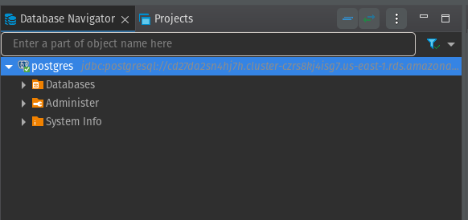

Note: this database has been deleted so the connection string is not valid

- click on the postgres database that was just created to load the data from the db
- for simplicity’s sake, you can rename the connection
- so that you know what it is for
- right-click on the connection
- when the dropdown list pops up, click on the one that says, "Rename"
- towards the bottom of the list
- type in the correct name for the connection

Connect to Local database

- to connect to the local database
- we will be using this connection string
- jdbc:postgresql://localhost:5432/database
- click on the radio button that says, "URL"
- paste this entire link in the URL section


- remember to enter the username and password
- make sure the Authentication dropdown list says, "Database Native"
- the username is user
- the password is password
- these credentials are taken from the docker-compose file


- then you can click on Test connection


- once done, you can then click on finish
- for simplicity’s sake, you can rename the connection
- so that you know what it is for
- right-click on the connection
- when the dropdown list pops up, click on the one that says, "Rename"
- towards the bottom of the list
- type in the correct name for the connection
- in my case, I used localhost

Changing the users' role:

- For security reasons, I have decided to not include functionality
- to change the role of the user
- however, the best way to change the user's role is in dbeaver

- go to the database for the heroku project
- click the open arrow to see the items under it


- then click on the one that says, "Databases"
- then we need to see the schemas that are for that database


- then open up schemas, public and tables

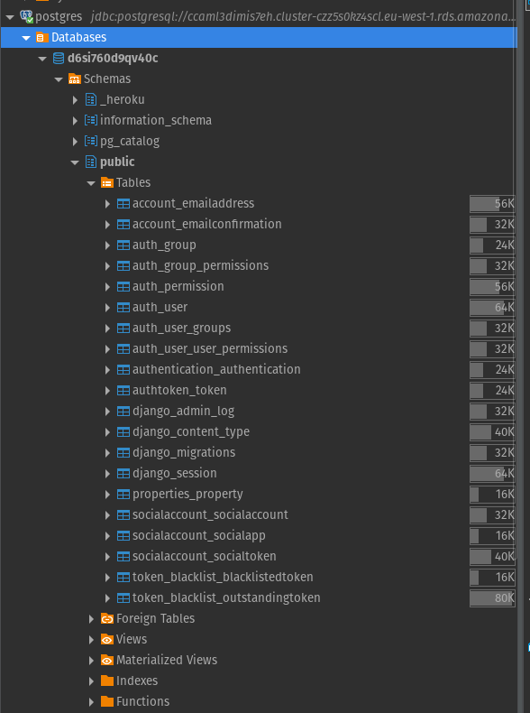

- that will be all the tables for your models
- which will include authentication tables
- double-click on the model that says, "auth_user"
- which should present you with this screen


- this is on the tab that says, "Data"
- to change the role of the user, you can click on superuser
- as it is a boolean value


- then you can click on save for saving that model
- that's all you need to do

#### [Environment Variables](#deployment)

REACT_APP_NODE_ENV environment variable

- This variable is only used for heroku
- it is used to tell node what environment you are in
- the key is REACT_APP_NODE_ENV
- and the value is going to be production

DJANGO_SETTING_KEY environment variable

- During local development, there is no need to use a secret key
- as it will automatically get generated for you
- But when you are running Django in the cloud
- Then you need a secret key
- To generate a secret key, go into the backend docker container
- I have created a Node.js script for that, just by running the following command

```
npm run django
```

- once in the container, run the following command to generate a new key

```
python manage.py shell -c "from django.core.management.utils import get_random_secret_key; print(get_random_secret_key())"
```

- save that newly generated key for Heroku or whatever services you need
- once you have saved the key then exit out of the container by running exit

```
exit
```

CLOUDINARY_URL environment variable

- go to your [cloudinary account](https://cloudinary.com/) and login
- on the far right, there are icons click on the one that says, "Programmable Media."
- on the right there is a blue button that says, "API environment variable"
- copy that api key replacing api key and secret key with the correct variables
- place this key in the .env file on your local machine for Django
- this environment variable is also used for heroku
- you can now go back to deployment setup

ENV environment variable

- create an environment for telling heroku that you are in production
- in the key section type: ENV
- in the value section type: production
- this environment variable is only used for heroku

---

### [Testing](#table-of-content)

#### [Manual Testing](#table-of-content)

- Login Form

| Title                                                      | Pass/Fail |
|------------------------------------------------------------|-----------|
| All Fields required                                        | Pass      |
| Form validation works with React hook form                 | Pass      |
| Click to Register: Register form loads                     | Pass      |
| Click to change password: Change Password form loads       | Pass      |
| Form validation works from server and is displayed on form | Pass      |
| Click on "X" closes the modal                              | Pass      |
| Click on Cancel modal is closed                            | Pass      |
| Modal heading says, "Login Form"                           | Pass      |
| Click on "Login" data gets sent to server                  | Pass      |
| Works on Heroku for live deployment                        | Pass      |

- Register Form

| Title                                                     | Pass/Fail |
|-----------------------------------------------------------|-----------|
| Modal heading says, "Registration Form"                   | Pass      |
| Click Login button: Login form loads                      | Pass      |
| All Fields required validation                            | Pass      |
| Form Validation works in React hook form                  | Pass      |
| Check if password 1 and 2 match                           | Pass      |
| Check for common passwords throw validation error         | Pass      |
| Check if password is numeric throw validation error       | Pass      |
| Check if length of passwords are longer than 8 characters | Pass      |
| Click on "Register" data gets sent to server              | Pass      |
| Click on Cancel modal is closed                           | Pass      |
| Click on "X" modal is closed                              | Pass      |
| Form validation works on server and is displayed on form  | Pass      |
| Works on Heroku for live deployment                       | Pass      |

- Change Password Form

| Title                                                             | Pass/Fail |
|-------------------------------------------------------------------|-----------|
| click Register button: register form Loads                        | Pass      |
| click login button: login form loads                              | Pass      |
| Modal heading says, "Change Password Form"                        | Pass      |
| Click on "X" modal is closed                                      | Pass      |
| Click on Cancel modal is closed                                   | Pass      |
| All Fields required validation                                    | Pass      |
| Check for common password for new_password throw validation error | Pass      |
| Check if password is numeric throw validation error               | Pass      |
| Check new_password is longer than 8 characters                    | Pass      |
| Form validation works in React hook form                          | Pass      |
| Form validation works on server and is displayed on form          | Pass      |
| Works on Heroku for live deployment                               | Pass      |

- Logout Form

| Title                               | Pass/Fail |
|-------------------------------------|-----------|
| Modal header says, "Logout Form"    | Pass      |
| Click on "X" modal is closed        | Pass      |
| Click on Cancel modal is closed     | Pass      |
| Logout message appears on Form      | Pass      |
| Submit button says Logout           | Pass      |
| Token Cookies get deleted on Logout | Pass      |
| Works on Heroku for live deployment | Pass      |

- Landing Page

| Title                                                      | Pass/Fail |
|------------------------------------------------------------|-----------|
| Search Properties button only shows when you are logged in | Pass      |
| if no data for carousel only single image is shown         | Pass      |
| only show a maximum of 3 images for the carousel           | Pass      |


- Dashboard Page

| Title                                                                | Pass/Fail |
|----------------------------------------------------------------------|-----------|
| if role admin show admin dashboard                                   | Pass      |
| if role user show user dashboard                                     | Pass      |
| if you are not an admin or not logged in show protected page         | Pass      |
| can only delete users with the role of user                          | Pass      |
| on the properties page only show properties that are still available | Pass      |

- Header

| Title                                                                | Pass/Fail |
|----------------------------------------------------------------------|-----------|
| Only show Home about links when not logged in                        | Pass      |
| show the dashboard when you are logged in                            | Pass      |
| provide the correct dashboard depending on your role in the database | Pass      |

#### [Auto Testing](#table-of-content)

Section Index

- [Testing the API locally](#testing-the-api-locally)
- [Testing React locally with Cypress](#testing-the-api-locally)

##### [Testing the API locally](#auto-testing)

Authentication

- I have only done basic testing for authentication as most of the testing was done manually
- Testing if a user can register
- Testing if a user can log in
- Testing if a user can change password

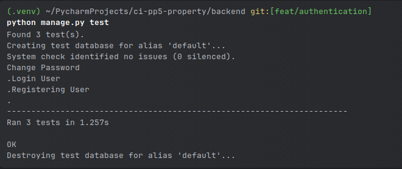

##### [Testing React locally with Cypress](#auto-testing)

Authentication

- I used Cypress e2e for testing the authentication
- I have created a script in package.json for running cypress

```
npm run test
```

- once you have run that command, a Cypress welcoming screen opens
- select E2E Testing
- then select the browser I selected firefox
- then click start E2E testing
- once it opens, click on the one that says authentication.cy.jsx
- as that I created for authentication testing
- the test will start to run immediately

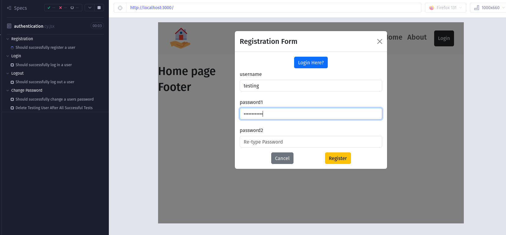

- once it has finished, you will see ticks next to the tests

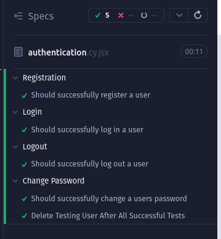

- I have run the tests 50 times by clicking refresh and it passed everytime

Note: Please do not stop the tests halfway as you will have to delete the testing user from db manual

Note: I have created an endpoint to auto delete the testing user from db after all tests have been completed

- Once the test has finished, you can press ctrl+c to exit the cypress terminal

---

### [Bugs](#table-of-content)

Description

- This repository was a complete re-build
- of a [React](https://github.com/douglas86/ci-pp5-property-react) and [Django](https://github.com/douglas86/ci-pp5-property-api) repository
- it has now been placed into one to solve alot of the bugs from the previous repo
- it should also make it easier to maintain as it is now one

Index

- [404 aren't found when updating properties](#404-arent-found-when-updating-properties)
- [Listing of the last remaining bugs](#listing-of-the-last-remaining-bugs)

#### [404 aren't found when updating properties](#bugs)

Problem?

- There are two get requests in the property card
- The first one is for if you only want a property by its id number
- The second one is if you want all the property data
- for some reason when trying to update it is calling both endpoints
- When it should only call the second one


Solution?

- This problem still exists
- But the program is working as expected

#### [Listing of the last remaining bugs](#bugs)

Description

- This is just a list of the last remaining bugs that need to be squashed
- They are small bugs that I have not been able to get to yet

List

- Footer seems to sit too high it doesn't want to be pushed to the bottom of the page were it should go
- Styling is not working when you scale below 350 pixels
- Warning message in console based on the fact that cloudinary is not using https
- When on the Admin Dashboard page, I can't seem to update the user's name
- Sometimes if an error message appears on the Login screen, and you switch to change password screen, the message is still left from the previous form

---

### [Credits](#table-of-content)

- [Code Institute](https://codeinstitute.net/) - Bootcamp
- [Luke Buchanan](https://www.linkedin.com/in/lukebuchanan67/) - Mentor
