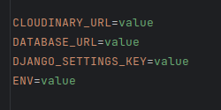

# Property Website

---

## Overview

This is a London-based property website.
This forms part of my final Project for Code Institute

---

## Table of Content

- [Planning](#planning)
  - [Wireframes](#wireframes)
  - [UX/UI Designs on Figma](#uxui-designs-on-figma)
  - [Color pallet](#color-pallet)
  - [User Stories using MOSCOW Prioritization techniques](#user-stories-using-moscow-prioritization-techniques)
- [Features](#features)
  - [Project Description](#project-description)
  - [GitHub Branching Strategy](#github-branching-strategy)
  - [Atomic Design Methodology](#atomic-design-methodology)
  - [Daphne Implementation for async/await with Django Rest Framework](#daphne-implementation-for-asyncawait-with-django-rest-framework)
- [Deployment](#deployment)
  - [Setting up on Heroku](#setting-up-on-heroku)
  - [Forking the GitHub Repository](#forking-the-github-repository)
  - [Making a Local Clone](#making-a-local-clone)
  - [Environment Variables](#environment-variables)
- [Testing](#testing)
  - [Manual Testing](#manual-testing)
  - [Auto Testing](#auto-testing)

---

### [Planning](#table-of-content)

Section Index
- [Wireframes](#wireframes)
- [UX/UI Designs on Figma](#uxui-designs-on-figma)
- [Color pallet](#color-pallet)
- [User Stories using MOSCOW Prioritization techniques](#user-stories-using-moscow-prioritization-techniques)

#### [Wireframes](#planning)

- Landing Page (Homepage)

Desktop


Mobile


- About Page

Desktop


Mobile


- Admin Dashboard Page: Profiles of the users using the site

Desktop


Mobile


- Admin Dashboard Page: Displaying of the users

Desktop


Mobile


- User Dashboard Page

Desktop


Mobile


#### [UX/UI Designs on Figma](#planning)

- Landing Page (Homepage)

Desktop


Mobile


- About Page

Desktop


Mobile


- Admin Dashboard Page: Profiles of the users using the site

Desktop


Mobile


- Admin Dashboard Page: Displaying of the users

Desktop


Mobile


- User Dashboard Page

Desktop


Mobile


#### [Color pallet](#planning)


#### [User Stories using MOSCOW Prioritization techniques](#planning)

##### Description

- This project was designed following the Agile Methodology
- Starting with the completion of the Landing Page
- Once that was completed, then move on to the next section
- Creating this Project feature by feature
- I first started with creating all the issues needed for the Landing Page
- GitHub bot would move that to the backlog and I would move it to Ready
- Then, before I started the cards for the Landing Page, I would create cards for the About Page
- Trying to always have something in the Backlog section of the Kanban board


##### Milestones

Landing Page

- The percentage of milestones completed
- 66% complete
- Open 5
- Ten closed


About Page

- The percentage of milestones completed
- 60% complete
- Open 9
- Fourteen closed


### [Features](#table-of-content)

Section Index
- [Project Description](#project-description)
- [GitHub Branching Strategy](#github-branching-strategy)
- [Atomic Design Methodology](#atomic-design-methodology)
- [Daphne Implementation for async/await with Django Rest Framework](#features)

#### [Project Description](#features)

- This is a complete CRUD application to help solve the Management of Properties
- During the design and implementation of this Project Agile Methodology was followed
- While using the GitHub Branching Strategy
- I was also able to make full use of the Atomic Design Methodology for the Look and feel of the site
- Async/Await was used for the Server side structure to make it very responsive on the server side

#### [GitHub Branching Strategy](#features)


- During the management of this Project, GitHub Branching Strategy was chosen
- GitHub Flow was chosen as it is a simpler alternative to GitFlow
- Where I just have the main branch and all other branches get branched and merged off of main
- The main purpose of this branching strategy was to keep the main branch production ready
- And hence can support Continuous integration (CI) and Continuous Delivery (CD) processes

GitHub Flow Pros and cons

- GitHub Flow focuses on Agile principles and so it is a fast and streamlined branching strategy with short production cycles and frequent releases.
- This strategy also allows for fast feedback loops so that teams can quickly identify issues and resolve them.
- Since there is no development branch as you are testing and automating changes to one branch which allows for quick and continuous deployment.
- This strategy is particularly suited for small teams and web applications, and it is ideal when you need to maintain a single production version.
- Thus, this strategy is not suitable for handling multiple versions of the code.
- Furthermore, the lack of development branches makes this strategy more susceptible to bugs and so can lead to an unstable production code 
- If branches are not properly tested before merging with the release preparation and bug fixes happen in this branch. 
- The main branch, as a result, can become cluttered more easily as it serves as both a production and development branch.
- A further disadvantage is as this model is more suited to small teams and hence, 
- as teams grow, merge conflicts can occur as everyone is merging to the same branch 
- and there is a lack of transparency, meaning developers cannot see what other developers are working on.

#### [Atomic Design Methodology](#features)


Description

Atomic design, developed by Brad Frost and Dave Olsen, is a methodology for crafting design systems
with five fundamental building blocks which, when combined, promote consistency, modularity and scalability.

The five building blocks are Atoms, Molecules, Organisms, Templates and Pages

Atoms

Basic building blocks of matter, such as a button, input and a form label. They're not useful on their own.

Molecules

Grouping atoms together, such as combining a button, input and form label to build functionality.

Organisms

Combining molecules to form organisms that make up a district section of an interface (i.e., navigation bar)

Templates

Consisting mostly of groups of organisms to form a page—where clients can see a final design in place.

Pages

An ecosystem that views different template renders.
We can create multiple ecosystems into a single environment—the application

Description of the design structure in a project setting

- The Atomic structure will be placed in the components directory
- The components directory I define as anything that you can see within the UX/UI design
- There are other components that fall out of the spec of the Atomic Structure
- For example, App.jsx, which sits in the construction directory
- this components' main purpose is to wrap the Layout Template around the hole project
- and to make use of Authentication tokens, and it is for the use of routing between pages

Description of Project structure

- API directory: defines the defaults for using create axios
- assets directory: used to store all static files like images for this document
- components directory: this is where the atomic design sits
- construction directory: this is where the App.jsx will sit
- context directory: all state store and reduced functions will be stored here
- hooks directory: storing of all custom designed hooks
- styles directory: CSS module files will be placed here
- utils directory: If I need some sort of logic that is going to be used often, used as helper functions
- index.js: The most important file in this project, 
- used for two purposes: 
- use as a wrap for the Provider function with the state store and to attach itself to the HTML file of for React

- There is a directory that is used outside the scope of the src directory
- called cypress
- this directory is used for the Cypress Testing framework

#### [Daphne Implementation for async/await with Django Rest Framework](#features)


Use Case of Daphne

- Daphne is an HTTP, HTTP2 and WebSocket protocol server for ASGI and ASGI-HTTP, developed to power Django Channels.
- It supports automatic negotiation of protocols; there’s no need for URL prefixing to determine WebSocket endpoints versus HTTP endpoints.
- This is crucial for applications that require real-time communication, 
- like chat applications, notifications or live updates

Why Daphne?

- Traditional DRF and Django are built on a synchronous request-response model (HTTP).
- However, WebSockets require asynchronous handling to maintain persistent, real-time connections between server and client.
- Daphne is an asynchronous ASGI (Asynchronous Server Gateway Interface) server designed to handle this,
- allowing you to manage WebSockets and other asynchronous protocols.

Why Did I choose Daphne for this Project?

- Python is trying to move more towards asynchronous programming, especially in web frameworks
- This Project is intended to be a long-lived project
- The hoping that the future of this project can provide a chat like system
- Where clients can book for maintenance issues on their properties and receive live updates on what is happening
- Or where maintenance officers need to give live updates to their call centers
- with the use of Daphne, I am hoping that it will improve performance issues within the app
- No more sitting around and waiting for a response

---

### [Deployment](#table-of-content)

Index
- [Setting up on Heroku](#setting-up-on-heroku)
- [Forking the GitHub Repository](#forking-the-github-repository)
- [Making a Local Clone](#making-a-local-clone)
- [Environment Variables](#environment-variables)

- Make sure to install [Docker Desktop](https://www.docker.com/)
- If you need additional assistance to install docker desktop
- click [here](https://www.youtube.com/watch?v=31ieHmcTUOk&list=PL4cUxeGkcC9hxjeEtdHFNYMtCpjNBm3h7) for YouTube video tutorials on getting setup

#### [Setting up on Heroku](#deployment)

- When creating your app on Heroku, I created two separate apps from one repository
- Reason for that, it will be easier to manage as I can keep the code separate from one another

- Head on over to the [Heroku Dashboard](https://dashboard.heroku.com/apps) to Log in
- Once you are Logged in, start by Creating the React app first
- by clicking on the New button on the right-hand side
- Then click on Create new app
- Enter the new apps name I called mine ci-pp5-property-v2-react bear in mind that app names are unique in Heroku
- Enter the Region were you want it deployed, clicking on the region that is closest to you
- You only have two options either the United States or Europe
- Click on Create app the app will then be created
- That is all we need to do for the React Heroku app as the rest will be done on the command line


- Now we need to create the second app the API
- Go back to the Heroku Dashboard and click on the New button on the right-hand side
- Then click on Create new app
- Enter the new apps name I called this one ci-pp5-property-v2-api bear in mind that app names are unique in Heroku
- Enter the Region were you want it deployed to click on the region that is closest to you
- You only have two options either the United States or Europe
- Click on Create app the app will then be created
- The next steps for the api will be the environment variables
- Once created, locate the tab that says, "Settings"
- Scroll down until you see config Vars as we need to create the environment variables
- Click the button that says reveal config vars
- There are two columns, the first is the key and the other the value
- You need to create four environment variables
- CLOUDINARY_URL, DATABASE_URL, DJANGO_SETTINGS_KEY, ENV
- scroll down to the [environment section](#environment-variables) to see how to set that up
- once down come back here


- The next stage is getting setup on heroku using the command line
- We will begin by setting up the React app first
- In the web browser for the React app that was created open up heroku logs
- So that we can see what is happening when commands are pushed
- To do that, click on the app name in the dashboard
- On the far right there will be a button that says, "More"
- In the popup menu, click on View logs
- when view logs are loaded, we need to go back to our IDE
- Getting the app ready for production
- open up a terminal in the IDE that you are using
- cd into the frontend directory

```
cd frontend
```

- Then log into the heroku container

```
heroku container:login
```

- Once login we can push and release the code needed
- By using two separate commands
- We first we push to Heroku

```
heroku container:push web --app ci-pp5-property-v2-react --arg Dockerfile
```

- the words after --app flag is the heroku apps name
- the flag --arg is used to say that there is an argument coming
- once you have pushed the code, then we need to use the release command

```
heroku container:release web --app ci-pp5-property-v2-react
```

- once that command has finished, then the React app is ready for production
- the next step is getting the API up and running


- In the heroku dashboard, go to the app that was created for Heroku API
- go to the Resources section as I created Postgres DB as an add-on to this project
- In the resources section type Postgres in the search bar
- When you start to type, the addons will appear
- Type postgres, click that to add it to your project
- A window pops up asking you to Submit order Form
- and it tells you the price
- once you click on the "Submit order Form" button
- Postgres gets added and the database environment variable
- get added to your project automatically
- open up the view logs for this heroku app
- the same way it was done to React
- now that the database is up and running, we can start getting our app ready for production
- go to the terminal in your IDE
- cd into the backend directory
- if you are still sitting in the frontend directory
- cd out-of-that first with this command

```
cd ..
```

- when you are in the home directory, then we can cd into the backend directory

```
cd backend
```

- Now we can push, release and migrate the database
- first, the code needs to be pushed to the database

```
heroku container:push web --app ci-pp5-property-v2-api --arg Dockerfile
```

- once the code has been pushed, then we can migrate the database

```
heroku run python manage.py migrate --app ci-pp5-property-v2-api
```

- when the migration is done, we can then use the release command for final production

```
heroku container:release web --app ci-pp5-property-v2-api
```

- Then you can go back to your web browser to the Heroku logs for this app
- give it a few minutes to update
- once finished, you can click the Open app button on the right-hand side
- Which will open the app in a new browser tab and load the app as JSON data

Note: build packs might not be necessary as I am using docker containers

#### [Forking the GitHub Repository](#deployment)

- Locate this [repository](https://github.com/douglas86/ci-pp5-property)
- make sure that you are on the tab that says, "Code"
- when on that tab, locate the tab that says, "Fork"
- Click on the Fork tab
- Once it has been forked
- You need to clone it to your [local machine](#making-a-local-clone)

#### [Making a Local Clone](#deployment)

- Making a local clone of this repo can either be done by ssh or http
- make sure that ssh is set up correctly on your PC before using it
- to ssh use the following command

```
git clone git@github.com:douglas86/ci-pp5-property.git
```

- to use http use the following command

```
git clone https://github.com/douglas86/ci-pp5-property.git
```

- create an .env file inside the backend directory
- scroll down to the [environment variables](#environment-variables) section of this document
- once the local environment variables have been created
- you need to then start the virtual machine
- to do that cd into the backend directory

```
cd backend
```

- to start your virtual machine, use the following command

```
source .venv/bin/activate
```

- this is going to be used for when you have to install new python packages
- once the virtual environment has started
- you can then start up the docker container
- make sure that docker desktop is running first
- then use the following command

```
docker-compose up
```

#### [Environment Variables](#deployment)



- create the necessary environment variables

DJANGO_SETTING_KEY environment variable

- django secret keys should never be committed to GitHub
- so if you need one, follow the following link
- [generate a new secret key](https://www.makeuseof.com/django-secret-key-generate-new/#:~:text=You%20can%20accidentally%20make%20your,are%20still%20learning%20about%20GitHub.)

CLOUDINARY_URL environment variables

- Login to your [cloudinary account](https://cloudinary.com/users/login)
- Locate your Profile image, which you should see at the bottom of the tab on the left
- Once on your profile page, go to your API Keys section
- At the top of that page copy the one that says, API environment variable
- place the API Key and API Secret in the correct places in the key parameters
- this key can now be placed in Heroku or for local development
- on the Heroku dashboard, there are two columns the key and the value
- place CLOUDINARY_URL in the key section
- and your api key in the value section
- on the local development in the .env file
- create the following object:
- placing CLOUDINARY_URL as the key
- and the api key for cloudinary as the value

DATABASE_URL environment variable

- I have added an addon postgres database with heroku
- This normally gets created automatically with Postgres addon
- but if you don't want the heroku addon, you can add your own env to the config vars
- there is no reason to use this locally as I am using docker containers
- all that gets built when docker builds

ENV environment variable

- this environment variable is only used on Heroku
- it is not necessary to use it locally
- the purpose of this variable is to tell the app when the app is in production
- in heroku, the key will be ENV
- and the value will be production

---

### [Testing](#table-of-content)

#### [Manual Testing](#table-of-content)

- Login Form

| Title                                                      | Pass/Fail |
|------------------------------------------------------------|-----------|
| All Fields required                                        | Pass      |
| Form validation works with React hook form                 | Pass      |
| Click to Register: Register form loads                     | Pass      |
| Click to change password: Change Password form loads       | Pass      |
| Form validation works from server and is displayed on form | Pass      |
| Click on "X" closes the modal                              | Pass      |
| Click on Cancel modal is closed                            | Pass      |
| Modal title says, "Login Form"                             | Pass      |
| Click on "Login" data gets sent to server                  | Pass      |

- Register Form

| Title                                                     | Pass/Fail |
|-----------------------------------------------------------|-----------|
| Modal title says, "Registration Form"                     | Pass      |
| Click Login button: Login form loads                      | Pass      |
| All Fields required validation                            | Pass      |
| Form Validation works in React hook form                  | Pass      |
| Check if password 1 and 2 match                           | Pass      |
| Check for common passwords throw validation error         | Pass      |
| Check if password is numeric throw validation error       | Pass      |
| Check if length of passwords are longer than 8 characters | Pass      |
| Click on "Register" data gets sent to server              | Pass      |
| Click on Cancel modal is closed                           | Pass      |
| Click on "X" modal is closed                              | Pass      |
| Form validation works on server and is displayed on form  | Pass      |

- Change Password Form

| Title                                                             | Pass/Fail |
|-------------------------------------------------------------------|-----------|
| click Register button: register form Loads                        | Pass      |
| click login button: login form loads                              | Pass      |
| Modal title says, "Change Password Form"                          | Pass      |
| Click on "X" modal is closed                                      | Pass      |
| Click on Cancel modal is closed                                   | Pass      |
| All Fields required validation                                    | Pass      |
| Check for common password for new_password throw validation error | Pass      |
| Check if password is numeric throw validation error               | Pass      |
| Check new_password is longer than 8 characters                    | Pass      |
| Form validation works in React hook form                          | Pass      |
| Form validation works on server and is displayed on form          | Pass      |

- Logout Form

| Title                               | Pass/Fail |
|-------------------------------------|-----------|
| Modal header says, "Logout Form"    | Pass      |
| Click on "X" modal is closed        | Pass      |
| Click on Cancel modal is closed     | Pass      |
| Logout message appears on Form      | Pass      |
| Submit button says Logout           | Pass      |
| Token Cookies get deleted on Logout | Pass      |

#### [Auto Testing](#table-of-content)

---